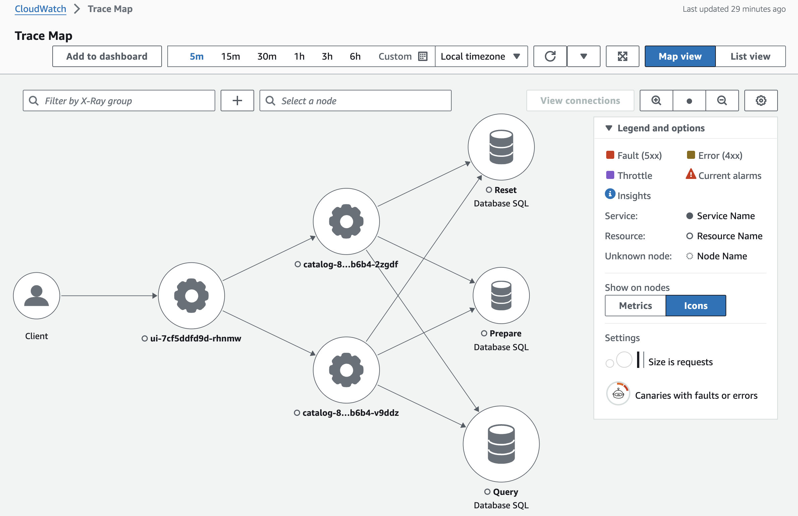

EKS Fargate Obeservability Demo
===


## Steps

### 1. Setup
#### 1.1 Create EKS Cluster
```
eksctl create cluster -f cluster.yaml
```

### 1.2 Install cert-manager
```
helm repo add jetstack https://charts.jetstack.io --force-update
helm upgrade --install \
  cert-manager jetstack/cert-manager \
  --namespace cert-manager \
  --create-namespace \
  --version v1.15.0 \
  --set crds.enabled=true \
  --set webhook.securePort=10260
```

### 1.3 Install adot addon
```
eksctl create addon --name adot --cluster fargate-observability-demo --region ap-southeast-1
```

### 2. Deploy Demo Application
```
kubectl apply -f base-manifest.yaml
kubectl rollout status -n catalog deploy/catalog-mysql
kubectl apply -f app-manifest.yaml
kubectl rollout status -n catalog deploy/catalog && kubectl rollout status -n ui deploy/ui
```


### 3. Generate Load
```
./gen-load.sh
```

Then you should see traces from CloudWatch/X-Ray
