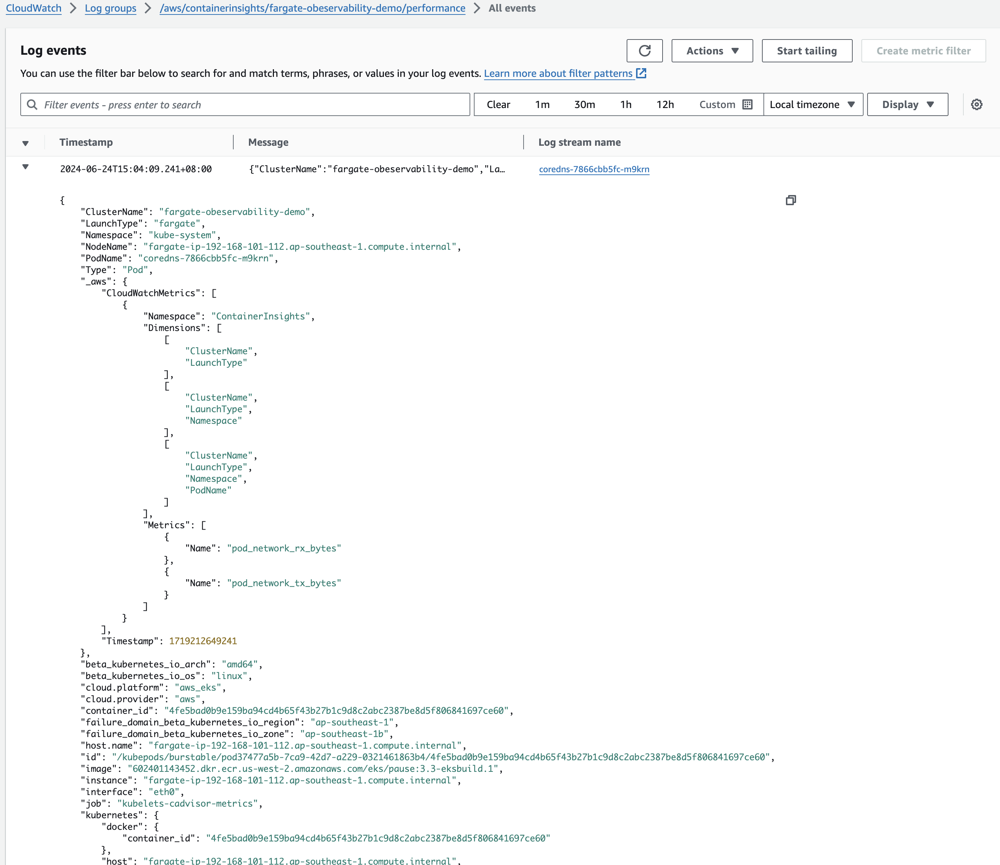

EKS Fargate Observability Demo
===


## Steps

### 1. Setup
#### 1.1 Create EKS Cluster
```
eksctl create cluster -f cluster.yaml
```

#### 1.2 Install cert-manager
```
helm repo add jetstack https://charts.jetstack.io --force-update
helm upgrade --install \
  cert-manager jetstack/cert-manager \
  --namespace cert-manager \
  --create-namespace \
  --version v1.15.0 \
  --set crds.enabled=true \
  --set webhook.securePort=10260
```

#### 1.3 Install adot addon
```
eksctl create addon --name adot --cluster fargate-observability-demo --region ap-southeast-1
```

### 2. Deploy Demo Application
```
kubectl apply -f base-manifest.yaml
kubectl rollout status -n catalog deploy/catalog-mysql
kubectl apply -f app-manifest.yaml
kubectl rollout status -n catalog deploy/catalog && kubectl rollout status -n ui deploy/ui
```


### 3. Generate Load
```
./gen-load.sh
```

Then you should see traces from CloudWatch/X-Ray


### 4. Configure Container Insights
Refernce: https://aws.amazon.com/blogs/containers/introducing-amazon-cloudwatch-container-insights-for-amazon-eks-fargate-using-aws-distro-for-opentelemetry/

#### 4.1 Configure IAM Role for Service Account (Optional)
This should be already configured if you are using provided `cluster.yaml` to create cluster. Otherwise, you may try with below commands to configure for your existing EKS cluster.
```
export CLUSTER_NAME=fargate-obeservability-demo
export REGION=ap-southeast-1
export SERVICE_ACCOUNT_NAMESPACE=fargate-container-insights
export SERVICE_ACCOUNT_NAME=adot-collector
export SERVICE_ACCOUNT_IAM_POLICY=arn:aws:iam::aws:policy/CloudWatchAgentServerPolicy

eksctl create iamserviceaccount \
--cluster=$CLUSTER_NAME \
--region=$REGION \
--name=$SERVICE_ACCOUNT_NAME \
--namespace=$SERVICE_ACCOUNT_NAMESPACE \
--attach-policy-arn=$SERVICE_ACCOUNT_IAM_POLICY \
--override-existing-serviceaccounts \
--approve
```
#### 4.2 Apply Container Insights manifest

```
kubectl apply -f container-insights.yaml
```


After a while, you should see the performance logs show in CloudWatch Logs.



Check the Container Insights
